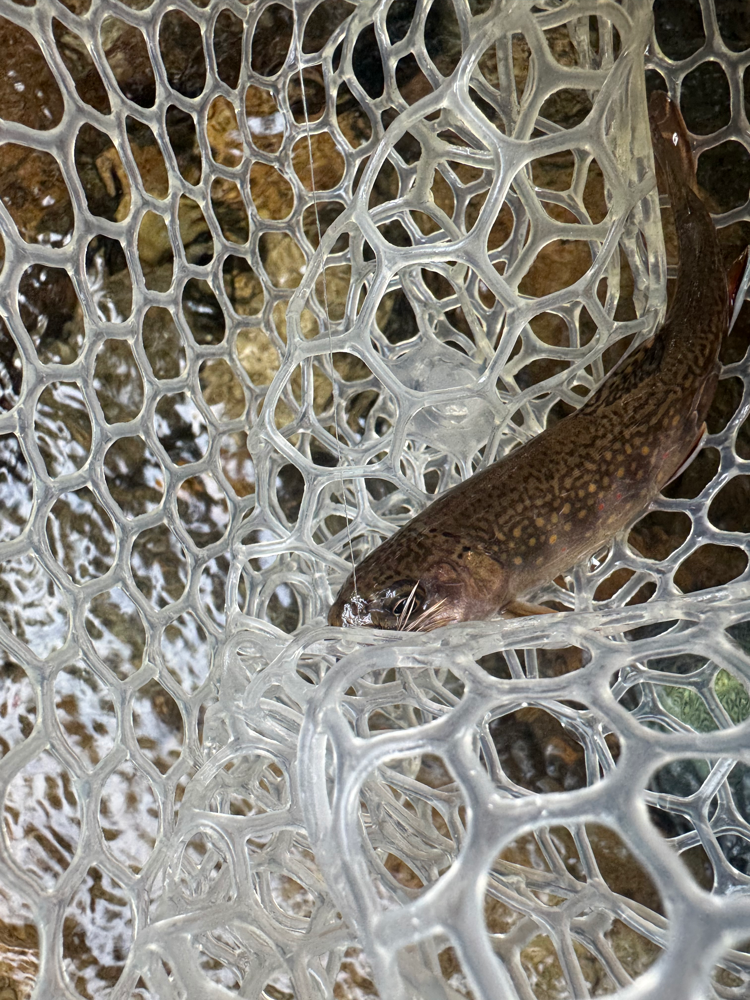
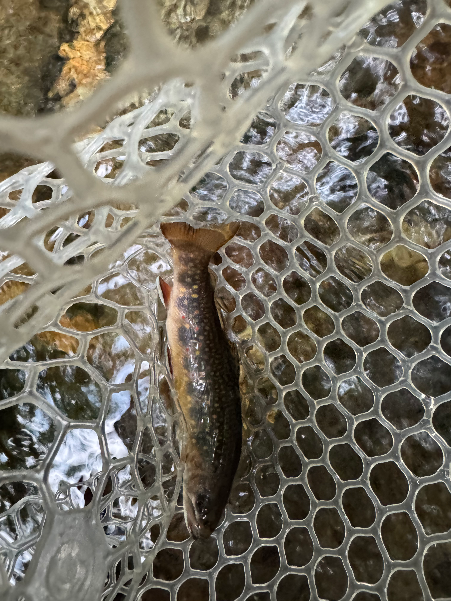
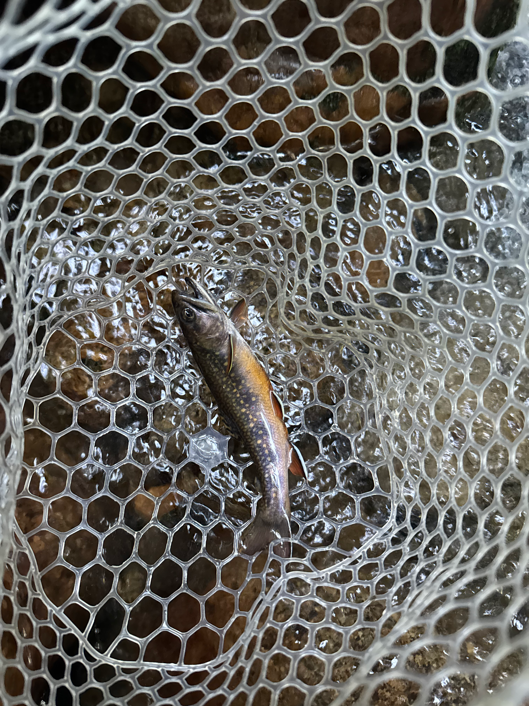
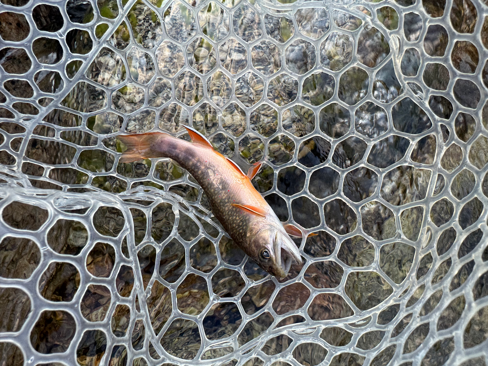
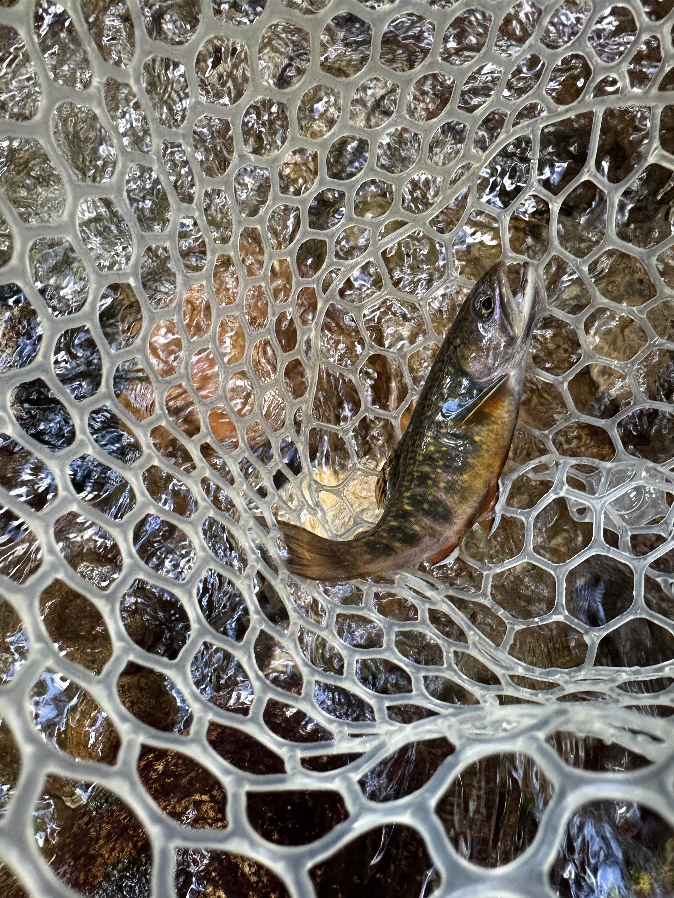

# A Week Stalking Alpine Streams

granite, clear water, and small places

brook trout

fallen timber and pocket water

red spots in the net

the wooden net

clouds over broken water

brook trout over the streambed

late light on granite

clear net, dark fish

red spots and blue halos

boots down by the water

