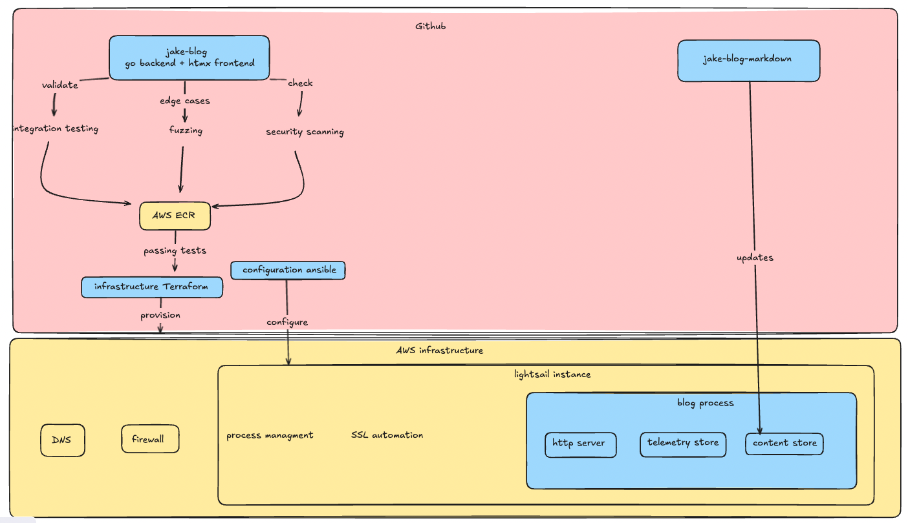

# Testing and Deploying my Personal Blog

## Initial Speed Bump

Off to a rough start here. The morning after I did the initial manual deploy; I discovered that my blog was timing out when I tried to connect. The culprit here was the bundle id I had chosen. I had picked the nano_3_0 lightsail bundle; which is the smallest and cheapest option. Turns out that paticular instance burns cpu credits when cpu utilization is over 5 percent and the blog was using around 5.1 percent of the cpu. This may be an optimization issue for later but I just upgraded to the slighlty more expensive small_3_0 bundle. I think I can get away with the micro_3_0 bundle but that will be resolved when I get a proper deployment set up.

Note from later. I did some testing with the nano size. My blog ran well under 5% utilization when I deployed it later. The only real difference I can find is that the blog is running in the background not in a tmux pane. I was not able to replicate this behavior on other instances. My best guess was that I lost the aws lottery; cheap lightsail instances are provisioned on scrap laying around the amazon datacenter. If my vm was running on a very old or failing cpu - writing and rendering logs to the foreground could conceivably be the culprit.

I think a singular lightsail instance is still a good option to host the blog on top off. An ec2 isn't cheaper out the box and the lightsail pricing model is more forgiving for one person. The gist is on lightsail I spend 5 dollars a month and get capped resources; where an ec2 has a lot more dials. Even when autoscaling is a non-factor its possible to spend more than you were planning. It is definetly worth looking at in the future after I have some better data on how the blog performs.

Right now this is the vision for the blogs infra.

* Singular lightsail instance - provisioned by terraform with github actions
* DNS/Firewall managed by AWS
* Configuration and deployment of the binary done by an ansible playbook

I think I could do the configuration entirely with terraform or ansible. TF is a very powerful tool for provisioning infra but it is not usually the best abstraction when configuring an operating system. Cloud providers often have a field where you can pass an init script but that doesn't give me a ton of confidence the vm will be in a state I want. Ansible can provision the server but the lack of state management combined with a community module I don't understand is hairy business. I would rather apply something like ansible over the already provisioned vm.

## Testing the code

I am not someone who writes a lot of tests frequently. I understand the value but it is just not something I do a lot. 

Testing the blogs code is a little tricky; an integration test proved more valuable from unit tests. The core functionality of this blog is not complex business logic or advanced algorithims(for now). The real risk is the plumbing I wrote not working with the individual components. The components are mostly from well known libraries so there is a good chance they already have unit tests; which would make mine redundant. The real risk here is somehow exposing private information or leaking an aws or github key. I believe storing the secrets in github actions is reasonable but I need to be reasonably sure I don't leak them or let someone mine bitcoin on my instance.

I decided to start with a integration test; an integration test verifies that all the components in my blog work together. This at least verfies the flow; I was able to test that markdown was being proccessed and served correctly. Basically what I do is spin up a blog on a random port then make sure it reads markdown, processes the markdown, serves it correctly, and the telemetry is correct

The next step was to fuzz my blog. Fuzzing is throwing random garbage at the blog untill it exhibits unexpected behavior. This is definetly not something I do frequently. However I thought I should attempt to do this because the blog would be exposed to the public internet. Essentially I am having the test request random links with fuzzed endpoints and looking for unexpected response codes.

Fuzzing the blog did actually force me to make some changes. The blog would respond with 500 response codes when it was a bad request; even if it may have techincally been a valid http message. I set up validation for uri length, non valid utf-8 characters, and null terminated values in the uri. According to my research most web server implementations are technically not compliant with the http spec because of edge cases like this. 

The next step was to perform a scan on the blogs code and the blogs with govulcheck and gosec. This gives me a rough confidence that I'm not using modules with known cve's or writing obvious vulnearabilitys.

## Deployment

I originally set the server up to only allow ssh connections from my personal IP and that doesn't feel like a great solution. At work I would typically have a bastion server with a runner or something; but I don't want to spend the money to have one running. I was leaning towards some type of mesh vpn like tailscale. Where only my personal laptop or the runner could connect to my instance over ssh. After a bit more research a mesh vpn does not appear to be the way. Tailscale's free tier has a 20 device limit which could be a real problem with github actions. Open source alterantives are frankly a project unto themselves and would cost more money for infra. However it is interesting enough to be something I would like to revisit. 

What I am going to do is punch a hole in the firewall during the deployment using the aws cli tool and close it as soon as the deployment finishes. This is not the worlds greatest solution but it is secure enough and doesn't require another week of research, extra money, or even more vendor lock in. I have seen this in the wild and I don't feel that bad about it. Just have to structure a block in ansible that will always close the hole behind it.

```
- block:
    - name: Get current public IP
      ansible.builtin.uri:
        url: https://api.ipify.org?format=json
        return_content: yes
      register: public_ip
      delegate_to: localhost
      changed_when: false

    - name: Ensure public IP was retrieved successfully
      ansible.builtin.fail:
        msg: "Failed to retrieve public IP"
      when: public_ip.json is not defined or public_ip.json.ip is not defined
      changed_when: false

    - name: Open SSH port for current IP
      ansible.builtin.command: >-
        aws lightsail open-instance-public-ports
        --instance-name {{ instance_name }}
        --port-info fromPort=22,toPort=22,protocol=TCP,cidrs="{{ public_ip.json.ip }}/32"
      delegate_to: localhost
      environment: 
        PATH: "/usr/local/bin:{{ ansible_env.PATH }}"
      changed_when: false

  always:
    - name: Close SSH port
      ansible.builtin.command: >-
        aws lightsail close-instance-public-ports
        --instance-name {{ instance_name }}
        --port-info fromPort=22,toPort=22,protocol=TCP
      delegate_to: localhost
      changed_when: false 
```

Lets talk about the actual configuration. Getting the blog to run is straightforward. I define a systemd unit file, template/copy a env file and a compose. The tricky part I had been avoiding is getting a tls cert. The easy solution is to use a lightsail load balancer but that blows my budget for something I can do myself; who needs a load balancer honestly I'll just use the poor mans load balancer dns. At work you can just open a servicenow ticket and blame the infrastructure team when it takes too long; I decided to setup certbot. The plan was to use the lightsail challenge plugin but that appears to have been abandoned and the route53 plugin is not worth migrating my DNS zone. The aws cli doesn't have a lightsail dns entry command so I am using the http challenge. I already had port 80 open so I don't see the harm; all I have to do is make a folder, serve it using busybox httpd then run certbot. This does work and I don't believe I've made my risk profile any worse. Running certbot on a server could be a problem for scaling later - with limits for identical certificates. This caps me on how much I can scale horizontally. I should have a seperate piece of automation provision the cert and push it out the servers but if the blog reaches the point where this is a real concern I'll consider that a good problem. 

## CICD 

Github actions is new for me. I prefer gitlab's approach of using an arbitrary container where you keep the actions in the pipeline and have custom containers for tools or the build environment. The saving grace is a tool called act. Which lets you run the workflow locally. Suprisingly easy to get going; I cannot say good enough things about it. Having to actually commit to see your pipeline run is silly. I'm suprised gitlab doesn't offer something like this.

The pipeline is pretty straightforward with four jobs. Build, test, and provision run concurrently and the final deploy-blog job runs the ansible playbook. Its pretty quick at 10 minutes to build,test,provision and deploy everything. 

## Roadmap

I'm going to write an article that isn't related to the blog. I'm thinking about how the go otel sdk works; I fiddled with some knobs making the blog that aren't googleable and chatgpt can't make it perfect in one-shot.

* Add RSS feed 
* Add custom markdown parser so the article pages have a bit more personality
* Benchmark and optimize the blog. I suspect I have some silly mistakes in the code and big pages might help. I do want to see if using quic instead of tcp makes a difference. 
* setup some real alerts 

## Emerging architecture


