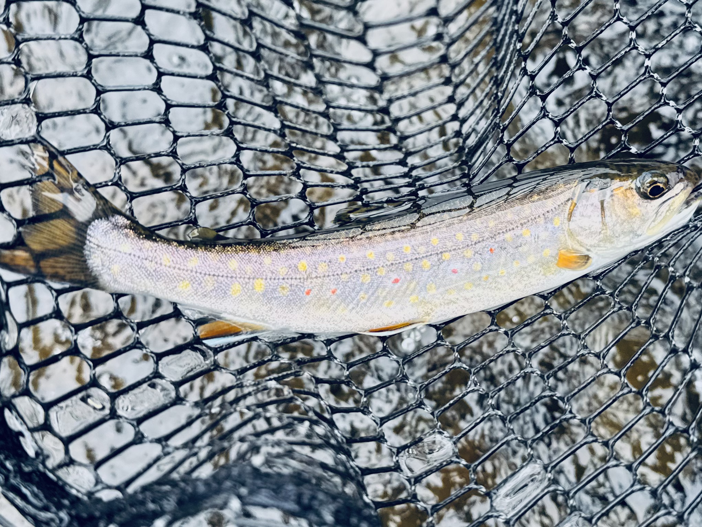
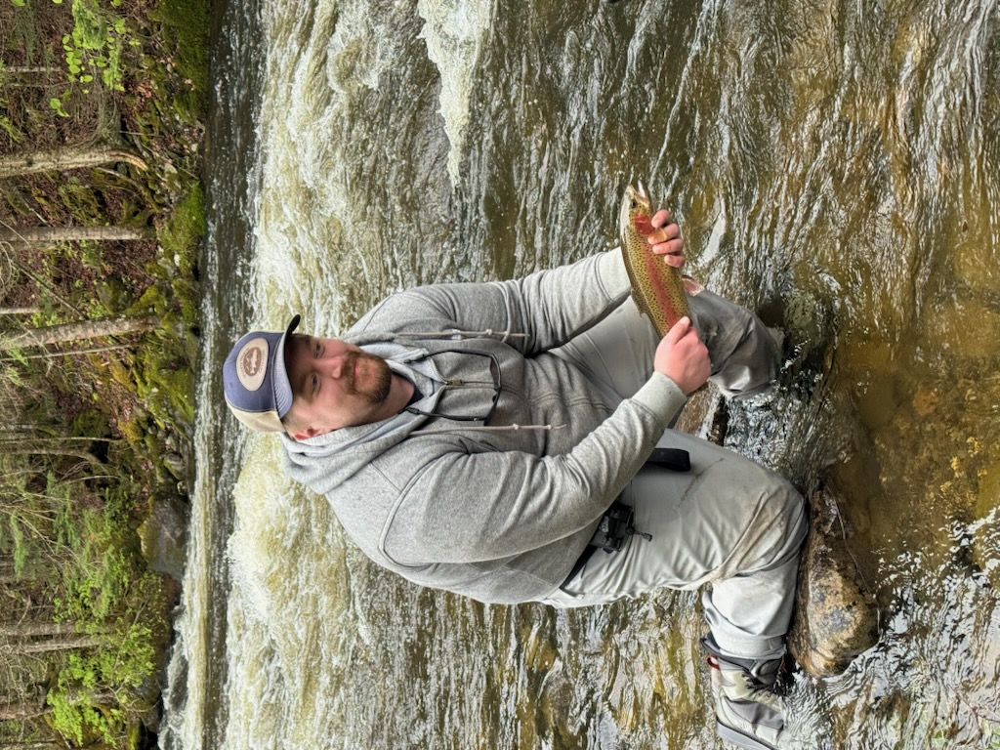
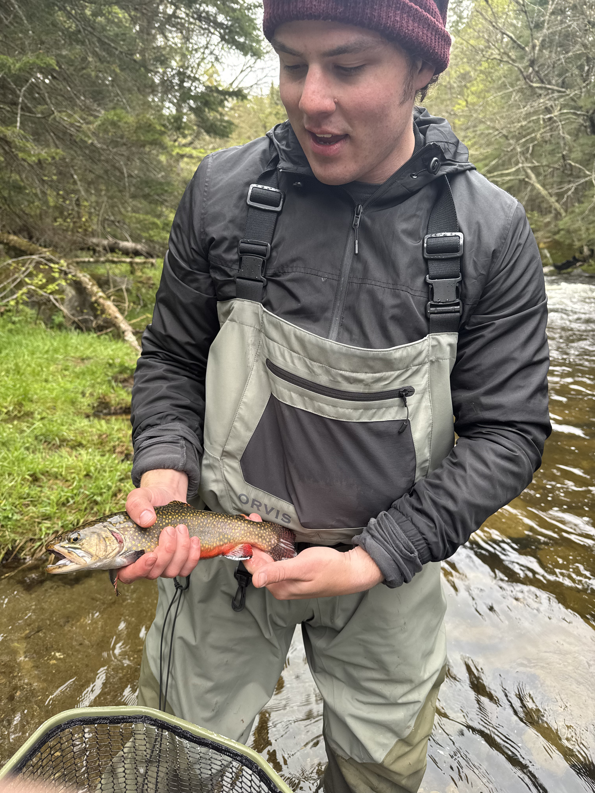

# Connecticut River trophy stretch - Memorial Day Weekend trip

## Background

This trip has been in the planning since early March. I happened to call an old college friend to catch up and brought up how over the last year I have transitioned from more conventional angling to fly fishing. Last year I had been bitten by the bug and have begun hunting trout along with the old reliable bass of my home waters.
To my surprise, he and another friend had been interested in starting fly fishing. I knew that I had to bring them up to the trophy stretch. I believe it is one of the higher quality tailwaters in New England. A couple good days and I could have them hooked for life. To their credit, they practiced casting and even took a clinic. I organized the lodging for 4 days and booked us a local guide for one day.

## Day 0 

I logged out of work and hit the road. It's a scenic drive, but after 3 1/2 hours you can get a little tired of the long and winding roads.
I was the first one up and sipped on cold Coors Banquet in a chilly mudroom. Eventually they arrived in the dark. One drunken reunion later, we went to bed and got ready for an early start.

## Day 1 - across the threshold

Weather: overcast and drizzly, borderline cold.
My plan for the day was to get us situated and comfortable on the water.
We got into a local fly shop as it opened at 7. We grabbed some flies and leaders as the river eats anglers' tackle like a hungry golden retriever underneath the dinner table.

We started with nymph rigs in the mid waters of the stretch. To my surprise, one of them hooked into a nice rainbow on the third cast. I whiffed two fish in those early pools, but I almost started to take it as a good sign. We worked upstream where it was a little tough.
Later we pushed downstream and hooked into some really nice rainbows in some larger pools.

Eventually we hiked out around 3 for lunch. We then went closer to the dam where it was tough fishing until dusk. I managed to squeak out a small salmon.
Overall a great start where no one got skunked.

## Day 2 - into the meat of it 

Weather: overcast with intermittent rain and drizzles.

We started closer to the inlet of Lake Francis. Very good fishing - we even ran into a small mayfly hatch later in the day as we hiked up further along the stretch.
We were crushing the step pools and pulled out a nice variety of species: fallfish, brookies, rainbows, salmon, and a brown.

The brown was a special catch as it was a nice fish in its own right and was one of the guys' first fish on a dry fly. Shame we couldn't get a better picture.

Later in the afternoon was tough as we tried the junction pools. I suspect the water was cold enough to kill a lot of the feeding activity.
Incredible day - no one got skunked and we pulled out some very pretty fish and some of respectable size!

## Day 3 - the peak

Weather: chilly with drizzles
This was our day with the guide.
Paul, our guide, took us to the Lake Francis inlet and quickly told us we were moving from the stretch as the water was cold and the rest of the stretch was full of other anglers.

We hiked into a conservation area in search of wild and native brook trout.
We started in some small water like a creek. We did some tight line nymphing and had some success with bead heads like a rosa pink.
These were the classic brookies and salmon you see in Orvis articles - little teardrops of dramatic coloration.

Paul then bushwhacked us to a remote part of the stream where we chased some bigger natives, but were bested by the wily backcountry brookies. Although one of the guys had one on but lost it close to the net. It was clearly a special place, but we were not ready to take full advantage of such an area yet.

We hiked out for lunch. This was where my body was starting to really hurt. I am no longer in the physical condition I should be after a few years in a desk job. My felt boots had me sliding all over the muck. I fell a good few times for good measure, but I was mostly able to not hold up the group.

At lunch our guide grilled us some sausages and peppers. We were all clearly beaten up from the morning but determined to make the most of what remained of our day.
We headed back to the trophy stretch after lunch as the sun had warmed the water some and other anglers had been put off by the weather.

Eventually we really hit our stride.
I caught the trophy of our trip - a gorgeous rainbow, full-bodied, around 17 inches. Clearly it had been in the system for some time. It was a tricky pool to reach.

I had to reach a pool on the far side with a roll cast and fight my line in the separate currents to get that perfect drift. Somehow I had a solid hookset and was able to pull him beneath the rapids and get him close enough for Paul to net. He jumped despite my best efforts, and I heard some audible gasps from my fishing partners.

Continuing on, we were able to hook into a few more and notably catch a nice brookie.

The hike out took a further toll on our bodies, but it really didn't matter. That was a pretty special day with multiple memorable fish. The exertion in the mild wilderness of New Hampshire was the perfect backdrop to all of this.

For dinner we went to an ATV bar, ate too much food, and drank some well-earned beers.
None of us were awake for much longer. Tired with full bellies, we got ready for our last day on the water.

## Day 4 - the taper

Weather: starting to see some sun.
We started out near the Lake Francis inlet. It was busy but probably the least busy part of the stretch. I was able to pull out two small salmon and miss two fish with a poor hookset, but the other guys were in danger of a skunk - the first real one of our trip. Eventually we were able to find some space in one of the pools.

It was getting later and we were running out of time before we had to hit the road, running dangerously low on our effective flies. Eventually we all stopped and focused on one of the guys. We started changing the indicator and adding split shot through a seemingly dead pool.

Then bam - fish on! We were barely able to get a nice rainbow into the net. This, to me, was the perfect note to end on. We had taken our collective knowledge and been able to troubleshoot a tough day to produce a beautiful fish.

We said goodbye and hit the road. Tired, I grabbed some coffee from the county store and drove away.

## Looking back

This trip accomplished everything I had hoped for and then some. 

There were great fish but I saw my friends become better fly anglers in a few short days. Especially notable was the growth in basic tackle and knots along with the ability to read the water and make adjustments. The trophy stretch lived up to the name. 4 days of varied condition and from those step pools crushing rainbows to the backcountry brookies that humbled us. It's not the worlds easiest water but you can be rewarded handsomely and punished harshly in the same afternoon.

