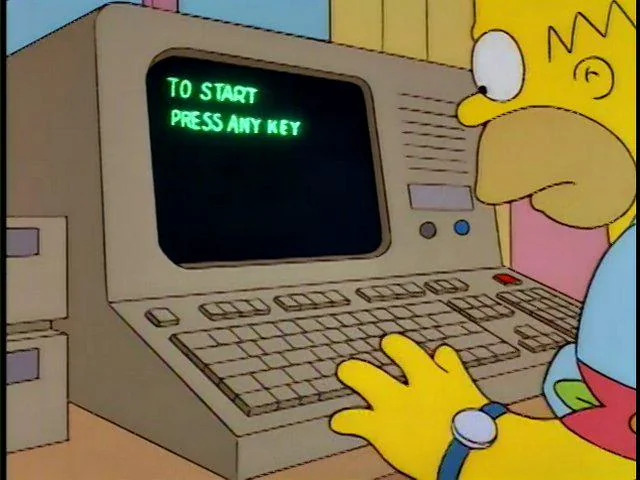

# Rambling about observability 

Rambling unconnected thoughts that may or may not be of value

## Observability is not monitoring and alerting 
This is where it all starts going to shit. You may monitor and alert on the data but it is a seperate thing. 
It should not be a thing we tack on to check a box or fufill a basic requirement. It is engineering the capability to understand 
different parts of your system at different levels. 

It is most certainly not a one time or infrequent thing you do to prevent incidents it is how the big boys run expirement and make their software better. 

Instrumentation should change frequently you need to make a hypothesis and validate it. Without this everything is a guess. 

Are we more reliable, is user engagment down, how is performance trending, do people use a new feature?

Oh jee boss I dunno probally but I haven't been paged in a while we must be doing good. 

## The lazy firefighter
Nothing drives me crazier when someone complains about a noisy alert. Have you I don't know tried fixing it. For the love of all that is holy make changes. 
The first pass of this stuff will never be perfect forver. Take some accountability and make your world a little better. 

## What if something bad happens
oh geez I dunno we'll fix it 

## We need to paper out everything
We need a list of alerts and everything that could possibly go wrong. We don't want to get things wrong when we launch. 

Oh cool; lets spend a lot of time and energy on this super useful exercise. 

## Lets jam everything into one collector 
all teams have the same needs. Developers can't make choices. We need to give everyone a compromise they won't use. 
Obligatory guardrails comment. 

## I don't use metrics in incidents; who knows what they all mean 
There's this neat new datastore called your brain where you can put this information. 

## Why don't we host prometheus ourselves
It'll save us a bunch of money; why would we pay for this. 

Its a suuuuper good idea. Lets make an underfunded and understaffed observability platform. 
It will drive shadow ops because people still need to do their job but some bean counter will be very pleased about how much less the line item is.

## I don't like this dashboard 
cool 

## What if we have a gap in the metrics 
whats neat is gaps are a useful signal

## We don't have the expertise to do this
why don't we build it you coward

## Go beyond the application and infra
slo's and dora actually mean something. Don't like it? Go bother Gene Kim 

## Don't toss it over the wall to another team who doesn't know your software 
last bastion of the lazy and unaccountable. Are you really going to trust someone else with your code.

## The good news 
It gets easier the more you do it. Outside of shoddy infra its kinda hard to get it completely wrong. Give smart people the tools and infra and the rest kind of follows. 
Most importantly you don't need super genuis architect data scientist; a few concienous people can take this observability stuff pretty far. Start with basics and 
every now and then make some changes. It doesn't have to be this broad program or expensive boondoggle. Just take a few steps and learn from it.
