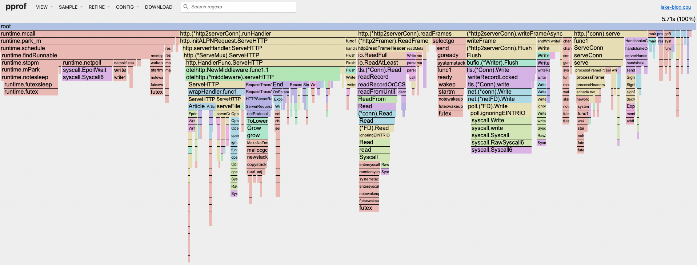
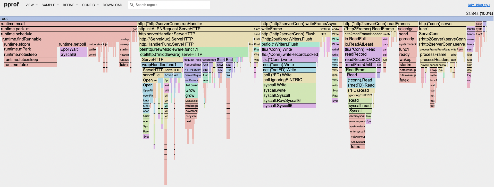
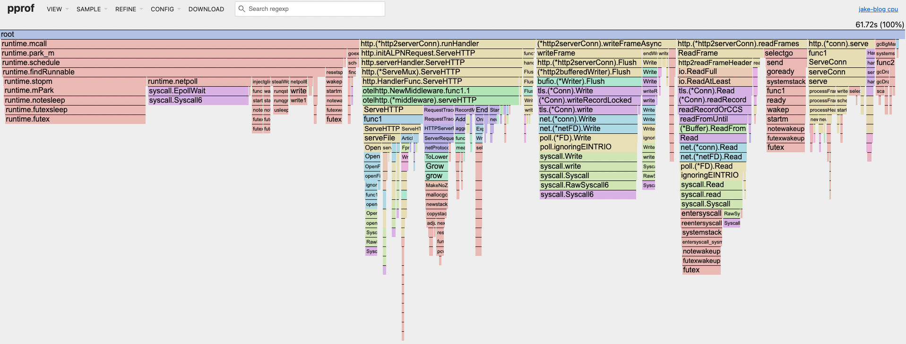
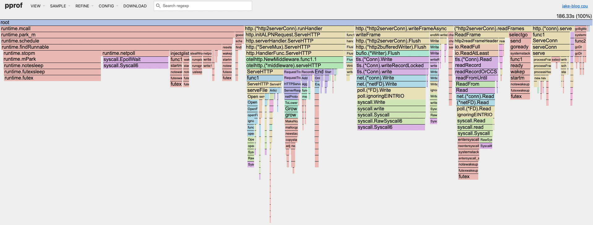

# Benchmarking, Profiling, and Optimizing my blog 
## Soapbox on optimization
>  You can't tell where a program is going to spend its time. Bottlenecks occur in surprising places, so don't try to second guess and put in a speed hack until you've proven that's where the bottleneck is -  Rob Pike


Optimization comes down to doing less. 
Less memory allocations, less iterations in a loop, less syscalls, less network hops, less cache misses, less tlb misses, etc

Generally the more specific to the hardware the code is; the less you have to do. 

Performance can be a hot topic for discussion on the internet because it is not the only consideration developers need to wrestle with. Reliability, security, and operational consistency are a big deal.

In distributed systems - complexity explodes further. 

On top of all that - devs need to deliver business value yesterday.

In the age of cloud most developers have layers of abstraction to navigate before the application code even runs. 
You probaly don't have the specs of your server and most of the time you don't need it. 

A common belief that gets thrown around when talking about optimization is that hardware is good enough and tuning doesn't really matter.

Which is a crock of shit - even for something simple like my blog. 5 vs 10 dollars equates to getting an extra coffee from Dunkin on my commute. 5000 vs 10000 a month on infra can matter a lot for companies. 

Note the last 2 months my AWS bill was 42 cents. 

Nothing is free; the flexibility of the cloud that lets you move fast with 5 9's infra isn't cheap.

In fact it was never cheap; companies had to invest in datacenters and wizards who understood hardware and effectively communicate to software devs. Nevermind the oppurtunity cost of waiting to provision servers for a new product or expirement.

A 500 dollar a month virtual machine in AWS is less powerful than a 1500 dollar server. 

Does this mean I am an on-prem luddite? No the opposite. It means there is a need to be performant-ish when when developing production code. Its pretty shocking the waste that happens at many orgs. Something as simple as moving a cluster to a smaller vm size can save a lot.

Theres a quote that gets thrown around a lot.

> Premature optimization is the root of all evil 

that never meant ignore application performance; it meant don't inline assembly into c before you know where the bottlnecks are. Its okay to spend a day or an afternoon on perf concerns.

The Pike quote at the top of this blog is often used in a funny way as well. He is not suggesting to ignore performance but rather you measure 
applications and pursue optimizations where the bottlenecks are.

I think that most developers agree it is worthwhile to save on cloud costs.

Its also worth noting that pretty much everytime performance is measured in a web application; user engagment goes up. If you want 
to spend time at work doing this work; its all about the dollars.

This is why mature giants like Meta spend years to speedup web applications; for the savings and the user engagment. 
If you are working on some internal tool; fine I concede.

Obvious things that need to be said 

- optimizing anything other than the bottleneck is not a good use of time. 
- having a working product is priority number 1
- a cheaper, faster product is a large competitive advantage.

I just wanted to say that its still important to understand how your application performs on a basic level because there are real consquences to not and its not that difficult. Below is my attempt at doing so for my personal blog.

## Making my blog go brrrrrrr

I'm going to concentrate on server latency because the html and javascript being rendered in the browser is straightforward.
Server response time becomes a reliable proxy for general application performance. If I can consistently reduce the latency percentiles I will declare victory.

Right now I'm just focusing on application code. 

The prod server could be tuned as well. Migrate from a docker container to baremetal is another option. Removing docker network stack to host networking is another option.

I could also shrink down or minify static assests. 

I'm reticent to do real load tests because I will likely eat through a bunch of cpu credits.

I suspect my blog is mostly fine but there's some uneeded allocations happening in the middleware and request handlers.

The blog server is under 100ms when I check in the chrome devtools. However that could still mean the difference between crashing or not during a serious traffic spike.

First thing is identify the endpoints where latency could be introduced to the user 

```
/article/<article>
/content 
/feed
/article/images/pretty-diagram.png
```
Now I need to write a script. Which performs a load test. I will play with different test profiles which mimic different traffic patterns of varying brutality.

During the performance tests I am going to capture a cpu profile. When I have the flame graph I am going to look for bottlenecks in the blog code. 

All the tests will happen on my local machine. Its not a perfect or even good match to my production server.
Still should give a decent idea for where the hotspots are. I am mostly interested if different traffic patterns have bottlenecks. 
Best case scenario is when different loads have the same bottlenecks. When different loads have different hotspots optimization becomes a moving target where it becomes almost impossible to make reasonable guesses about what is happening in production without extensive telemetry and continous profiling. 

I'm pretty sure it won't apply here because the blog doesn't manage any state I can't throw away, read-heavy access patterns, there aren't any db or api calls in request paths. 
Combined with the fact that changes to the underlying data is infrequent; using a read mutex incurs a small cost.

If only it was always this easy. In the real world you might have database servers that are a black box.
Not to mention the politics of trying to improve someone elses silo is not always met with open arms. This is why you don't want to work in a pathological orginization. 

The real lesson is just put your data in a cache and update it in another thread. This pattern is used everywhere from the linux kernel to react. It seems simple but hard to beat.

Hopefully the following tests can confirm my hypothesis that the blog scales linearly. 

### test profiles 
#### gentle
```
  gentle: {
    stages: [
      { duration: '30s', target: 20 }, // Ramp up to 20 users over 30 seconds
      { duration: '1m', target: 20 },  // Stay at 20 users for 1 minute
      { duration: '30s', target: 0 },  // Ramp down to 0 users
    ],
    sleepBetweenRequests: { min: 1, max: 2 },
    thresholds: {
      http_req_duration: ['p(95)<500'], // 95% of requests should complete within 500ms
    }
  },

Test Profile: gentle
Endpoint Latency Percentiles (ms)
================================
                  p50      p90      p95      p99
Static Files:    7.29     15.01    18.84    23.88
Article List:    6.14     12.68    17.66    24.86
Single Article:  8.92     17.99    22.08    30.84
RSS Feed:        6.47     12.97    14.71    19.94

Total Requests:  1205

running (2m00.8s), 00/20 VUs, 1205 complete and 0 interrupted iterations
```


#### moderate 
```
moderate: {
    stages: [
      { duration: '30s', target: 50 },  // Ramp up to 50 users
      { duration: '2m', target: 50 },   // Stay at 50 users for 2 minutes
      { duration: '30s', target: 0 },   // Ramp down
    ],
    sleepBetweenRequests: { min: 0.5, max: 1.5 },
    thresholds: {
      http_req_duration: ['p(95)<750'], // More lenient threshold
    }
  }

Test Profile: moderate
Endpoint Latency Percentiles (ms)
================================
                  p50      p90      p95      p99
Static Files:    5.94     16.31    19.76    28.87
Article List:    5.06     14.71    18.23    23.84
Single Article:  7.22     17.54    22.12    31.59
RSS Feed:        5.30     15.37    19.19    28.01

Total Requests:  7504

running (3m01.3s), 00/50 VUs, 7504 complete and 0 interrupted iterations
```


#### harsh 
```
harsh: {
    stages: [
      { duration: '20s', target: 100 }, // Quickly ramp up to 100 users
      { duration: '1m', target: 200 },  // Ramp up to 200 users over 1 minute
      { duration: '2m', target: 200 },  // Stay at 200 users for 2 minutes
      { duration: '30s', target: 0 },   // Ramp down
    ],
    sleepBetweenRequests: { min: 0.1, max: 0.5 },
    thresholds: {
      http_req_duration: ['p(95)<1000', 'p(99)<2000'], // More lenient thresholds
    }
  }

Test Profile: harsh
Endpoint Latency Percentiles (ms)
================================
                  p50      p90      p95      p99
Static Files:    1.43     2.70     3.96     8.25
Article List:    1.34     2.53     3.74     7.79
Single Article:  1.64     3.03     4.53     8.87
RSS Feed:        1.35     2.51     3.67     7.81

Total Requests:  122320

running (3m50.4s), 000/200 VUs, 122320 complete and 0 interrupted iterations
```


#### violence 
```
violence: {
    stages: [
      { duration: '500s', target: 500 },
      { duration: '10s', target: 0 },
    ],
    sleepBetweenRequests: { min: 0.1, max: 0.5 },
    thresholds: {
      http_req_duration: ['p(95)<1000', 'p(99)<2000'], // More lenient thresholds
    }
  }

Test Profile: violence
Endpoint Latency Percentiles (ms)
================================
                  p50      p90      p95      p99
Static Files:    1.55     3.14     4.77     12.48
Article List:    1.46     3.01     4.58     12.73
Single Article:  1.72     3.43     5.16     13.03
RSS Feed:        1.47     3.00     4.47     12.02

Total Requests:  419470

running (8m30.3s), 000/500 VUs, 419470 complete and 0 interrupted iterations
default ✓ [======================================] 000/500 VUs  8m30s
```



This is how I am interpreting the results 

linear scaling confirmed. bottlenecks do not change significantly across different load patterns. 
warmup effect was considerable
there isn't any major bottlenecks or hotspots 
the blog spends most of its time in the go runtime and syscalls; while HTTP connection handling and middleware are also significant. 
I'm not planning on changing the middleware; I do actually want to have otel data. My validation logic is O(1) operations I want to happen.

I could probally call it a day and say good enough. But I do have an idea I want to test. Based on my rant from before I should just stop.
However I am going to test an idea and see how much/little changes. 

Remove allocations in the handlers for articles and the articlelist. 

When looking at the flame graph; I zoom into my application towers; specifically the handlers and notice fmt.Fprintf is pretty wide.

If I store the content as byte arrays I should be able to use the http.ResponseWriter.Write function which shouldn't need to do any allocations most of the time. 
I can hide the string processing/templating in the update loop which is infrequent it may be possible to shave some milliseconds off.

When storing the articles, article, and rss feed as byte arrays I did see some interesting results. 

I was able to shave maybe a tenth of a millisecond off of the server response in the first 3 percentiles. Not very exciting.
However the slowest requests were almost halved. 
```
Test Profile: harsh
Endpoint Latency Percentiles (ms)
================================
                  p50      p90      p95      p99
Static Files:    1.28     1.94     2.32     4.38
Article List:    1.20     1.83     2.19     4.16
Single Article:  1.49     2.17     2.58     4.90
RSS Feed:        1.21     1.83     2.20     4.15

Total Requests:  122614

running (3m50.3s), 000/200 VUs, 122614 complete and 0 interrupted iterations
```

Not bad .. 
similiar results when running the load test with the violence profile. This change was a small improvement to most percentiles and had a bigger impact on tail latency.
```
Test Profile: violence
Endpoint Latency Percentiles (ms)
================================
                  p50      p90      p95      p99
Static Files:    1.54     2.86     3.99     10.57
Article List:    1.44     2.75     3.85     10.27
Single Article:  1.71     3.10     4.38     10.94
RSS Feed:        1.45     2.75     3.83     10.61

Total Requests:  420318

running (8m30.3s), 000/500 VUs, 420318 complete and 0 interrupted iterations
```

In a language like go reducing allocations can make a real difference because you reduce garbage collection pauses. GC pauses are whats going to turn a normal request to a long one. 

So what did I learn from all this? My blog scales pretty damn well out of the box, which isn't shocking since it's a simple Go server with minimal dependencies. The flame graphs confirmed my hypothesis - no weird bottlenecks and linear scaling across different load patterns.

Could I have left it alone? Absolutely. But curiosity got the better of me, and making those small tweaks to reduce allocations in the handlers had a nice payoff for tail latency. The p99 times were almost cut in half in some cases, which means fewer users experiencing those annoying slow loads.

This whole exercise reinforces what I was ranting about earlier - you don't need to go crazy with premature optimization, but understanding your performance characteristics and making targeted improvements where it matters can have real benefits. A little bit of work potentially helped a future hiring manager read an article that went viral(fingers crossed).

Truthfully theres a lot of stones I left unturned but I'm serious this time when I  don't win anything for going further right now.

```
measure first, optimize second, stop copying strings when you don't need to.
```


