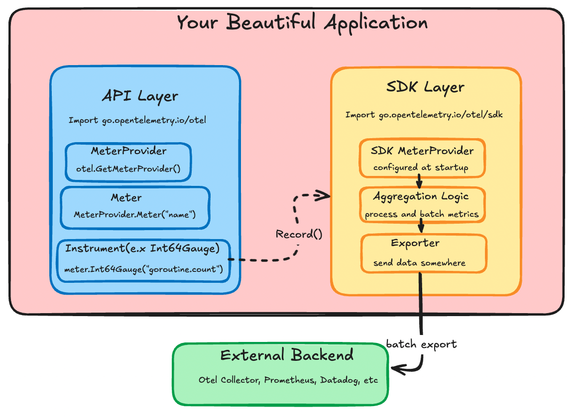
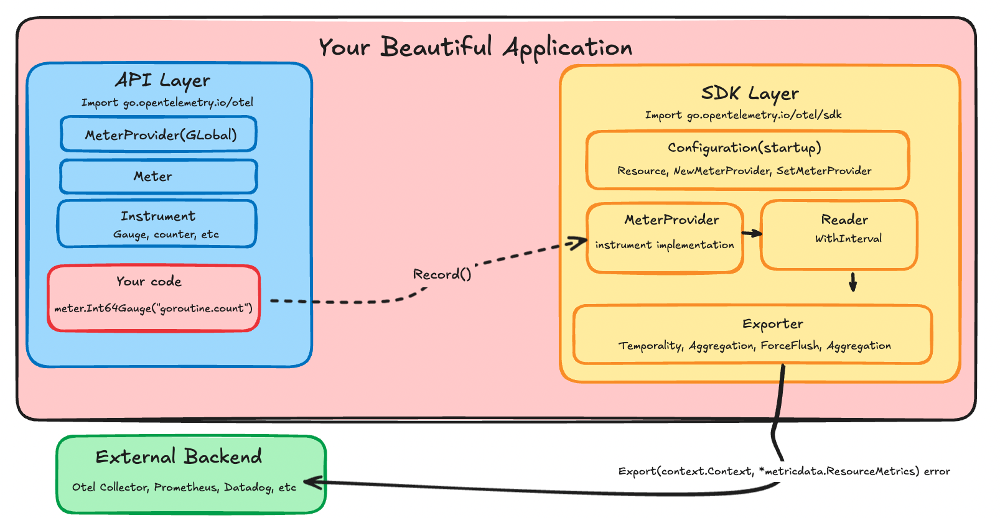

# Groking the otel api/sdk with metrics 

grok -> to understand intuitevely 

This is the article I wish I had read before reading the OpenTelemetry documentation. We will look at concepts in the OTel framework, the specific implementation for the API and SDK, and instrumenting metrics in a go program. The goal after reading this should be to understand how the framework works at a rough level by being able relate the concepts to the implementation of metrics in a Go program.

OpenTelemetry matters because it's everywhere. The OTel documentation is above average but having a primer will make your reading experience easier. What's missing is a satisfactory mental model of how it all fits together when you inject it into your code - how the components actually interact in practice, not just what they do in theory. You won't need to know Go to follow along; the patterns apply across most OTel implementations. However you will need a basic understanding of what observability is and some programming background.

## The OpenTelemetry framework
The official definition is 

"An Observability framework and toolkit designed to create and manage telemetry data such as traces, metrics, and logs.
Vendor- and tool-agnostic, meaning that it can be used with a broad variety of Observability backends, including open source tools like Jaeger and Prometheus, as well as commercial offerings.
Not an observability backend like Jaeger, Prometheus, or other commercial vendors.
Focused on the generation, collection, management, and export of telemetry. A major goal of OpenTelemetry is that you can easily instrument your applications or systems, no matter their language, infrastructure, or runtime environment. The storage and visualization of telemetry is intentionally left to other tools."

If I had to simplify to my past self I might say 

"A collection of standards and code libraries to export data that represents the state of your application"

This is not unique or new but being able to send your data to every backend worth mentioning is. Another side bonus is that 
lots of libraries instrument with OTel. Meaning including well known software into your application is a batteries included experience.

### API 
Think about how something like a metric reaches a backend or collector; crossing the boundary of your application. I want you to think about how you call metric.record and how that specific value or datapoint reaches an outside system. 

It wouldn't be very efficent for the record function to open and close a socket every time its called. There has to be a layer that aggregates and batches the datapoints before they are sent to a backend. Having this layer is also how Otel can integrate with everything. 
```go
goRunNum.Record(ctx, int64(runtime.NumGoroutine()))
```
Somehow when you call this function the number of goroutines your application is using is sent somewhere else. 

The framework has two different levels you need to think about; the API and the SDK. The API is the interfaces that "instrument" the code. The SDK is the structs and functions which control the collection, proccesing, aggregation, and export of your metric. The code example above is API code that tells OTel to record a value for something specific.

OTel has the concept of instruments; they are the things that create your measurements or data points. goRunNum in the above example is a metric type instrument. An instrument can produce a metric but it can also produce things like a trace, log, or profile. Instruments can be different in interface and implementation but they are the same thing. 

Put plainly 
"An instrument is a construct that creates datapoints of a specific type. Different instrument types produce datapoints with different shapes, but they all serve the same purpose - measuring something in your application"

This instrument pattern is how you should look to understand the different types of data your application could emit

```go
meter := otel.GetMeterProvider().Meter("super-observable-application") // factories which eventually give you an instrument

goRunNum, err := meter.Int64Gauge("goroutine.count", // this is the instrument 
		metric.WithDescription("number of goroutines"), // you can pass information which can be helpful to downstream backends
		metric.WithUnit("goroutines"))
if err != nil {
	log.Printf("failed to initialize runtime metrics %v", err)
	return
}

// some application stuff happens here 
goRunNum.Record(ctx, int64(runtime.NumGoroutine()))
```

The meter is a factory for making instruments. The otel.GetMeterProvider is a factory for meters. It's initalized with some state you define somewhere at the start of your application. Defining that is the only SDK code you really need for most applications. We'll get back to that. For now just remeber if its anything to do with pushing a datapoint its API code; anything below that is the SDK. 

In go an easy way to tell determine if code is from the API or SDK is to look at the import path. 

```go
"go.opentelemetry.io/otel"
```
is the API. The SDK is cordoned off under
```go 
"go.opentelemetry.io/otel/sdk"
```

To get a better sense of the API lets look at the structures used in the example where we record the number of goroutines an application is using. 

This is the meter interface. Look at the example where we create instrument; can you see we name our name our Int64Gauge instrument and provide some InstrumentOptions
```go 
// Meter interface (simplified)
type Meter interface {
    // Synchronous instruments
    Int64Counter(name string, options ...InstrumentOption) (Int64Counter, error)
    Float64Counter(name string, options ...InstrumentOption) (Float64Counter, error)
    Int64Gauge(name string, options ...InstrumentOption) (Int64Gauge, error) //look at me
    Float64Gauge(name string, options ...InstrumentOption) (Float64Gauge, error)
    // there are other instrument types
}

func (m *meter) Int64Gauge(name string, options ...metric.Int64GaugeOption) (metric.Int64Gauge, error) {
	cfg := metric.NewInt64GaugeConfig(options...)
	const kind = InstrumentKindGauge
	p := int64InstProvider{m} // wraps the meter to connect API calls with SDK implementation
	i, err := p.lookup(kind, name, cfg.Description(), cfg.Unit()) // finds or creates the actual instrument implementation in the SDK
	if err != nil {
		return i, err
	}

	return i, validateInstrumentName(name)
}
```
The options seem to be wrappers around a description. Most developers will not need to wrangle these internals. You'll want to look at what options your exporter uses. 
```go 

type InstrumentOption interface {
	Int64CounterOption
	Int64UpDownCounterOption
	Int64HistogramOption
	Int64GaugeOption

  // there are a lot more types of options
}

type Int64GaugeOption interface {
	applyInt64Gauge(Int64GaugeConfig) Int64GaugeConfig
}

type Int64GaugeConfig struct {
	description string
	unit        string
}

type descOpt string

// geting into the territoty of the sdk
func (o descOpt) applyInt64Gauge(c Int64GaugeConfig) Int64GaugeConfig {
	c.description = string(o)
	return c
}
```

This is the definition of the Int64Gauge
```go 
// Int64Gauge is an instrument that records instantaneous int64 values.
//
// Warning: Methods may be added to this interface in minor releases. See
// package documentation on API implementation for information on how to set
// default behavior for unimplemented methods.
type Int64Gauge interface {
	// Users of the interface can ignore this. This embedded type is only used
	// by implementations of this interface. See the "API Implementations"
	// section of the package documentation for more information.
	embedded.Int64Gauge

	// Record records the instantaneous value.
	//
	// Use the WithAttributeSet (or, if performance is not a concern,
	// the WithAttributes) option to include measurement attributes.
	Record(ctx context.Context, value int64, options ...RecordOption)
}
```

Take a minute and consider the OTel API so far. 

* instruments are the constructs that emit data 
* meters are the factory for instruments 
* meters have factories which hook instruments into SDK configuration/implementation
* data will be passed to SDK code which will do some proccesing and send it out in batches




### SDK

This is all the SDK code you would ever need to think about when instrumenting an application for a metric. This would happen at application startup

```go 
// metadata stuff
res, err := resource.Merge(resource.Default(),
	resource.NewWithAttributes(semconv.SchemaURL,
		semconv.ServiceName("my-service"),
		semconv.ServiceVersion("0.1.0"),
	)
)
if err != nil {
	return nil, err
}

// exporter is what actually sends your data somewhere
// in this example it is stdout but it could be prometheus or datadog 
metricExporter, err := stdoutmetric.New()
if err != nil {
	return nil, err
}

// sound familiar?
meterProvider := metric.NewMeterProvider(
	metric.WithResource(res),
	metric.WithReader(metric.NewPeriodicReader(metricExporter, // reader sits between instruments and exporter
		metric.WithInterval(3*time.Second))), // reader is part of the batching mentioned earlier
)

// Register as global meter provider
otel.SetMeterProvider(meterProvider)
```

If all you want to do is start blasting data around you will now be equiped to read the documentation for your exporter. You can stop now but there will be another pretty diagram further down below.

For me it really started to click when I looked at the exporter code. Start with the interface of an exporter. This is what all exporters have to implement 

```go
type Exporter interface {
  // define if metrics are reported as accumulated totals since start (cumulative)
  // or only what changed since last report (delta)
	Temporality(InstrumentKind) metricdata.Temporality
	
  // define how datapoints from the same instrument are grouped together
  // e.x sum, histogram, lastvalue 
  Aggregation(InstrumentKind) Aggregation
	
  // where you actually open the socket and send the datapoint
  Export(context.Context, *metricdata.ResourceMetrics) error
	
  // send everything you have buffered now 
  ForceFlush(context.Context) error
	
  // kill -9 "your application"
  Shutdown(context.Context) error
}
```
Now lets take a look at the stdoutmetric Export implementation

```go 
func (e *exporter) Export(ctx context.Context, data *metricdata.ResourceMetrics) error {
	if err := ctx.Err(); err != nil {
		return err
	}
	if e.redactTimestamps {
		redactTimestamps(data)
	}

	global.Debug("STDOUT exporter export", "Data", data)

	return e.encVal.Load().(encoderHolder).Encode(data)
}
```
All it does print a representation of a "batch" of your metrics. The batch is configured by the reader or other configuration from where you create the SDK objects at startup

```go 
type ResourceMetrics struct {
	// Resource represents the entity that collected the metrics.
	Resource *resource.Resource
	// ScopeMetrics are the collection of metrics with unique Scopes.
	ScopeMetrics []ScopeMetrics
}
```
A scope is basically the resource metadata struct we created earlier. A well known library might have its own instrumentation and thats a seperate scope. 

A more sophisticated exporter might care about the type of metric. Here's an example of that 

```go 
func (e *MetricsExporter) Export(_ context.Context, metrics *metricdata.ResourceMetrics) error {
	for _, scopeMetrics := range metrics.ScopeMetrics {
		for _, m := range scopeMetrics.Metrics {
			switch data := m.Data.(type) {
			case metricdata.Gauge[int64]:
				for _, point := range data.DataPoints {
```
DataPoints are the measurements recorded in your batch



## Putting it into practice 
That's it! Now you have the primer I wish I'd had.

The next time you're puzzling over the docs, I hope you I helped you see beyond the pieces to understand how they connect in your code.

Now go forth and build those beautiful dashboards.

