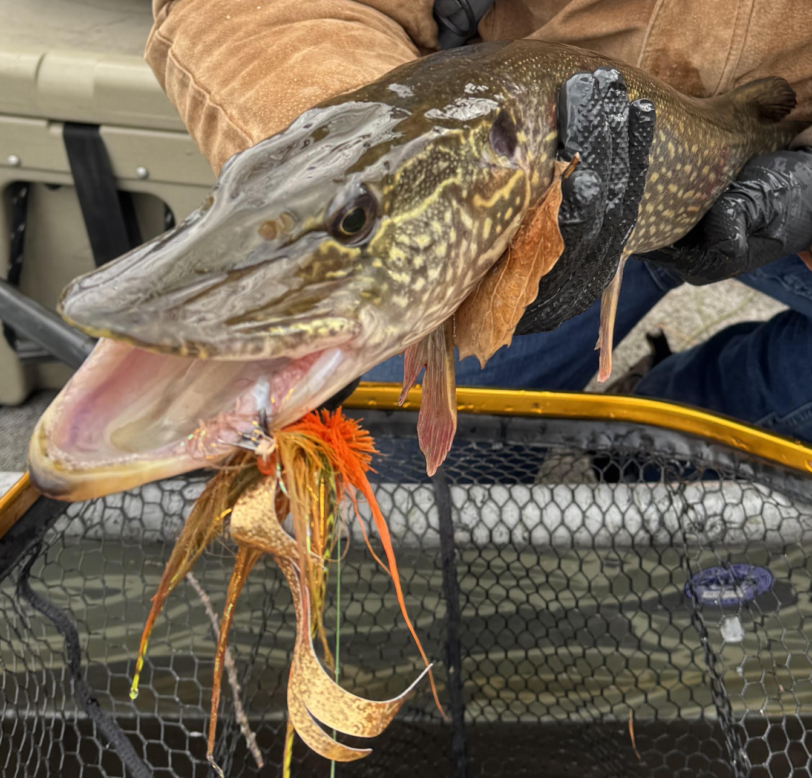

# Pike on the fly 

Pike on the fly is new to me. I highly recomend it; this is the kind of thing that people reorient their lives around. 

Bombing a giant fly with an 11 wt rod. It's a full body activity; there's little room for casting deficencies. You have to slowly twitch and feel through the murky gloom. Hours of patience rewarded with a sudden huh is that something? Then BAMMMMM extreme violence. A short but brutal fight with every mistake translating to one that got away. Thick heavy rods bent like a walmart special. 

On a fly

* Trout fishing feels sophisticated 
* Bass fishing feels familiar but different 
* Pike fishing feels completly alien. A new world revealed

I should keep targeting the new. What else is there to do?

