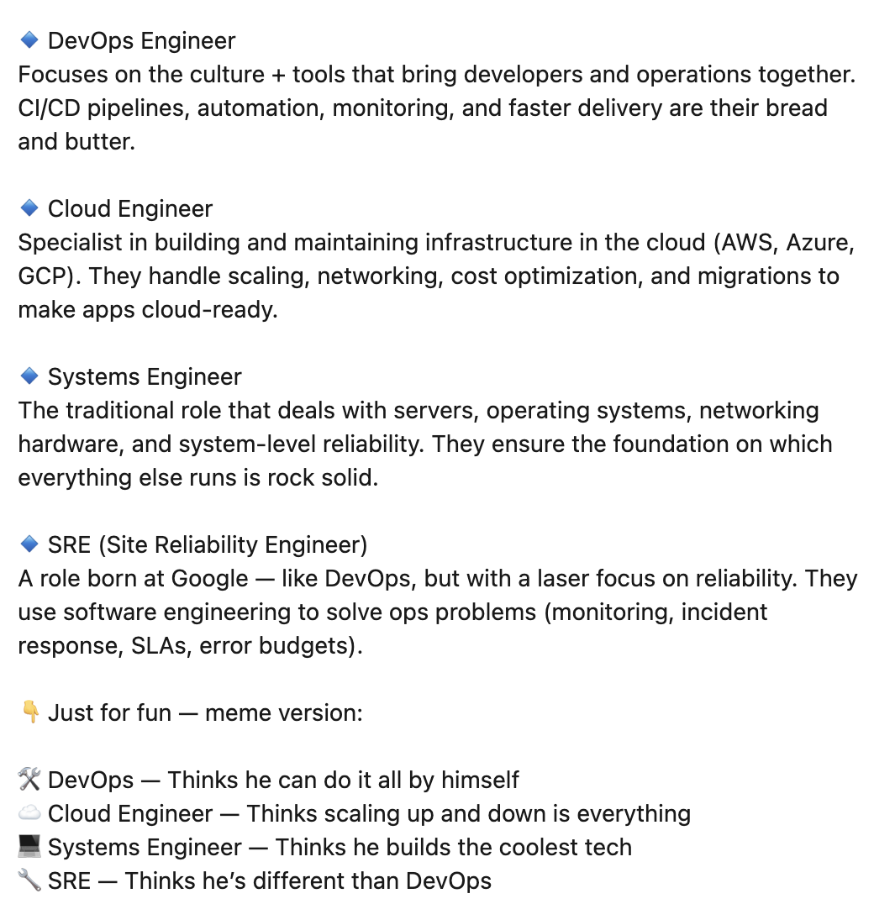

# Titles at work 
What role people call me at work is not really something that I give a lot of thought to.

However I've seen some alarming posts on linkedin and have noticed real people thinking this way. 

People seem to label several roles that are functionally identical 

* devops engineer
* cloud engineer 
* platform engineer
* site reliability engineer

You might say these are seperate things but they are not. 

All of these roles are system administrators. The job description for them are going to have 80-90% of the same requirements 
For some reason sysadmin has become a dirty word. If I had to guess its because the market decided to pay more for the same thing.

Maybe it means that the role has a specific focus but lets be realistic. Anyone in this role will be asked to do everything at some point. Not a bad thing either 

When we define ourselves in a narrow scope we think narrowly. 

I'm SRE I do alerting 
I'm devops I do pipelines 
I'm cloud I write terraform 

The reality of being of a good sysadmin in 2025
means you are a programmer, a linux admin, dba, cloud admin, and anything else that becomes a problem.
When you can't look at these domains holistically you will not solve big problems. 

You need to understand production, how code gets to production, how to keep production up and anything which could break production. 

A good sysadmin thinks in systems not specialities. We are judged by the ability to solve tricky cross domain problems. 
I've heard all of the arguments before. Mile wide inch deep, t shaped, blah. 

It all means nothing; yes someone will be deeper in one thing but the fun of this job is moving around, jumping into the fire, and leaving it better than you found it. 
When we label ourselves as a something we limit ourselves. I would have half the knowledge I have if all I did was sit in a narrow silo. 

There's space for specialization but it is the technology not the role. I might be stronger with containerization while my coworker knows more about block storage. 
We are doing the same thing; I don't doubt that he get up to speed on what I'm doing and vice versa. 

Be nimble, be able to say I don't know I will figure out. 

All this stuff feeds into itself; I betcha you will grow way more in a year of this than a year of trying to specialize.
