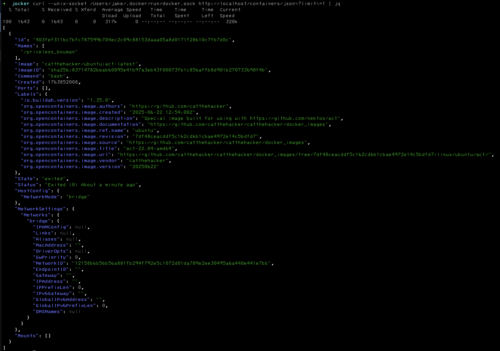
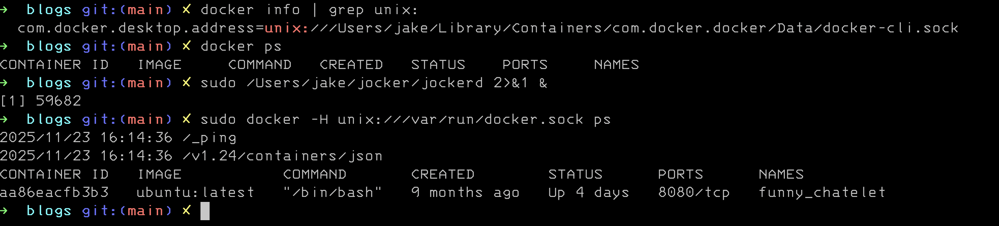
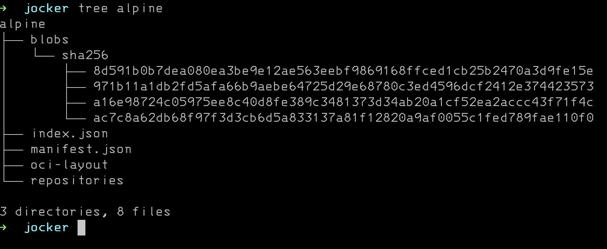
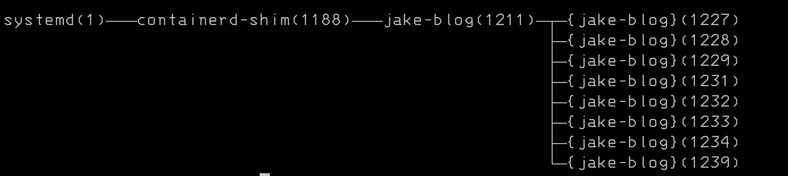
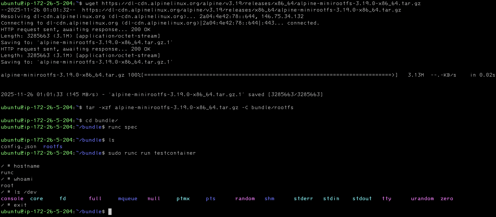
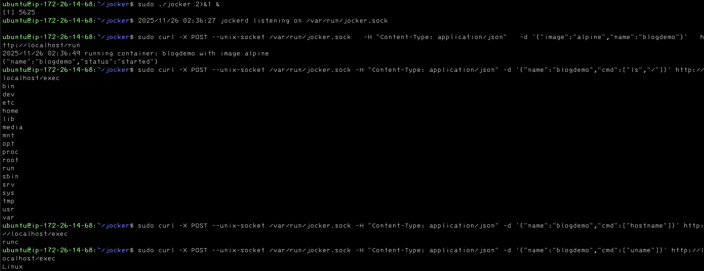

# How to write a container runtime 
This is a walk through of enough theory and practical code examples to build a working albeit toy container runtime. 

I am writing this to crystalize my understanding of containerization beyond the operation of software. This is ultimately written for someone with some exposure to containers and the tooling around it.

Ideally this article is a bridge between high level fluff and the arcane.

## What are we even talking about
```
docker cli → dockerd → containerd → runc → libcontainer → clone(2)
```

Before we can make a runtime we have to know the thing being ran. "Container" suggests packaging or virtualization baked in. While  explanations say no virtualization I think in practice its easy to conflate in your head. The mechanism of containerization is process restraint. The original term "jail" captures this better. A container is a process with an isolated view of the kernel. The kernel copies structs pid, network, mount, etc so the process can't see outside its namespace. No virtualization or packaging happening. 

When talking about containers you have to mention OCI. Open container initiative is a group which maintains runc. Runc is another cli tool that containerd or other runtimes use to actually make the containers. This means that docker utimately does a fork exec into runc. You can use runc on the terminal but the creators will say its not reccomended. Its made for container runtimes exclusively.

Runc is not the end of OCI. They also maintain the image and runtime spec. Which is how container images are created, ran, and distributed. You'll see but its really a folder with a json file and a folder. It seems straightforward but its a common interface to run containers with different stacks. I mean you could do it anyway you wanted but this is someone saying do it this way and enough people have listened. 

I want it to be clear that OCI has nothing to do with the kernel features that enable containers but in practice OCI is what the world uses right now. There is not competition the same way breathing has no competition. 

If you go to google and ask what a container is you will get something like 
```
A container is a standard unit of software that packages an application and all its dependencies, such as libraries and configuration files, into a single, isolated executable unit. This allows the application to run reliably and consistently across different computing environments, from a developer's laptop to a production server or the cloud. Unlike virtual machines, containers share the host operating system's kernel, making them lightweight and efficient. 
```

The way I would might answer what a container is 
```
the branding around a software stack to create kernel namespaces and run software in them
```

Not that different but its a lot of words to express the same thing. But it should be much clearer what it means to create a container runtime; fiddling around in a well known stack

It should be noted that OCI containers are fundamentally a linux thing. You may be able to run containers "on windows or mac" but they are really doing all the work in some kind of vm. You cannot seperate containers from the linux kernel features.

## Docker
Docker has two components

* `docker` cli
* `dockerd` daemon 

The CLI sends HTTP over a Unix socket to the daemon. The daemon is a web server using IPC instead of TCP.



The daemon doesn't create namespaces directly. It calls containerd service, which uses the runc. Runc wraps libcontainer; the library that organizes the actual syscalls. Libcontainer was the original code Docker open sourced. It's the base that let OCI exist.

The daemon listens on `/var/run/docker.sock` or something like that.

simplest possible way to start a container

`docker run catthehacker/ubuntu:act-latest`

docker run is two api calls 

* POST /containers/create

201 
application/json
```
{
  "Id": "<id>",
  "Warnings": []
}

```
* POST /containers/{id}/start

204

Its actually pretty easy to "trick the docker api". Here's an example with docker ps 
```
package main

import (
	"log"
	"net"
	"net/http"
	"os"
)

const socketPath = "/var/run/docker.sock"

func main() {
	err := os.RemoveAll(socketPath)
	if err != nil {
		log.Fatalf("failed to remove existing socket: %v", err)
	}

	listener, err := net.Listen("unix", socketPath)
	if err != nil {
		log.Fatalf("Failed to bind to socket: %v", err)
	}
	defer listener.Close()

	err = os.Chmod(socketPath, 0660)
	if err != nil {
		log.Fatalf("failed to set socket permissions: %v", err)
	}

	mux := http.NewServeMux()
	mux.HandleFunc("GET /_ping", handlePing)
	mux.HandleFunc("GET /{version}/containers/json", handlePS)
	mux.HandleFunc("/", handleNotImplemented)

	log.Fatal(http.Serve(listener, mux))
}

func handlePS(w http.ResponseWriter, r *http.Request) {
	log.Print(r.RequestURI)
	w.Header().Add("Content-Type", "application/json")
	dummyJSON := `
[
  {
    "Id": "aa86eacfb3b3ed4cd362c1e88fc89a53908ad05fb3a4103bca3f9b28292d14bf",
    "Names": [
      "/funny_chatelet"
    ],
    "Image": "docker.io/library/ubuntu:latest",
    "ImageID": "sha256:72297848456d5d37d1262630108ab308d3e9ec7ed1c3286a32fe09856619a782",
    "ImageManifestDescriptor": {
      "mediaType": "application/vnd.oci.image.manifest.v1+json",
      "digest": "sha256:c0537ff6a5218ef531ece93d4984efc99bbf3f7497c0a7726c88e2bb7584dc96",
      "size": 424,
      "urls": [
        "http://example.com"
      ],
      "annotations": {
        "com.docker.official-images.bashbrew.arch": "amd64",
        "org.opencontainers.image.base.digest": "sha256:0d0ef5c914d3ea700147da1bd050c59edb8bb12ca312f3800b29d7c8087eabd8",
        "org.opencontainers.image.base.name": "scratch",
        "org.opencontainers.image.created": "2025-01-27T00:00:00Z",
        "org.opencontainers.image.revision": "9fabb4bad5138435b01857e2fe9363e2dc5f6a79",
        "org.opencontainers.image.source": "https://git.launchpad.net/cloud-images/+oci/ubuntu-base",
        "org.opencontainers.image.url": "https://hub.docker.com/_/ubuntu",
        "org.opencontainers.image.version": "24.04"
      },
      "data": null,
      "platform": {
        "architecture": "arm",
        "os": "windows",
        "os.version": "10.0.19041.1165",
        "os.features": [
          "win32k"
        ],
        "variant": "v7"
      },
      "artifactType": null
    },
    "Command": "/bin/bash",
    "Created": 1739811096,
    "Ports": [
      {
        "PrivatePort": 8080,
        "PublicPort": 80,
        "Type": "tcp"
      }
    ],
    "SizeRw": 122880,
    "SizeRootFs": 1653948416,
    "Labels": {
      "com.example.vendor": "Acme",
      "com.example.license": "GPL",
      "com.example.version": "1.0"
    },
    "State": "running",
    "Status": "Up 4 days",
    "HostConfig": {
      "NetworkMode": "mynetwork",
      "Annotations": {
        "io.kubernetes.docker.type": "container",
        "io.kubernetes.sandbox.id": "3befe639bed0fd6afdd65fd1fa84506756f59360ec4adc270b0fdac9be22b4d3"
      }
    },
    "NetworkSettings": {
      "Networks": {
        "property1": {
          "IPAMConfig": {
            "IPv4Address": "172.20.30.33",
            "IPv6Address": "2001:db8:abcd::3033",
            "LinkLocalIPs": [
              "169.254.34.68",
              "fe80::3468"
            ]
          },
          "Links": [
            "container_1",
            "container_2"
          ],
          "MacAddress": "02:42:ac:11:00:04",
          "Aliases": [
            "server_x",
            "server_y"
          ],
          "DriverOpts": {
            "com.example.some-label": "some-value",
            "com.example.some-other-label": "some-other-value"
          },
          "GwPriority": 10,
          "NetworkID": "08754567f1f40222263eab4102e1c733ae697e8e354aa9cd6e18d7402835292a",
          "EndpointID": "b88f5b905aabf2893f3cbc4ee42d1ea7980bbc0a92e2c8922b1e1795298afb0b",
          "Gateway": "172.17.0.1",
          "IPAddress": "172.17.0.4",
          "IPPrefixLen": 16,
          "IPv6Gateway": "2001:db8:2::100",
          "GlobalIPv6Address": "2001:db8::5689",
          "GlobalIPv6PrefixLen": 64,
          "DNSNames": [
            "foobar",
            "server_x",
            "server_y",
            "my.ctr"
          ]
        },
        "property2": {
          "IPAMConfig": {
            "IPv4Address": "172.20.30.33",
            "IPv6Address": "2001:db8:abcd::3033",
            "LinkLocalIPs": [
              "169.254.34.68",
              "fe80::3468"
            ]
          },
          "Links": [
            "container_1",
            "container_2"
          ],
          "MacAddress": "02:42:ac:11:00:04",
          "Aliases": [
            "server_x",
            "server_y"
          ],
          "DriverOpts": {
            "com.example.some-label": "some-value",
            "com.example.some-other-label": "some-other-value"
          },
          "GwPriority": 10,
          "NetworkID": "08754567f1f40222263eab4102e1c733ae697e8e354aa9cd6e18d7402835292a",
          "EndpointID": "b88f5b905aabf2893f3cbc4ee42d1ea7980bbc0a92e2c8922b1e1795298afb0b",
          "Gateway": "172.17.0.1",
          "IPAddress": "172.17.0.4",
          "IPPrefixLen": 16,
          "IPv6Gateway": "2001:db8:2::100",
          "GlobalIPv6Address": "2001:db8::5689",
          "GlobalIPv6PrefixLen": 64,
          "DNSNames": [
            "foobar",
            "server_x",
            "server_y",
            "my.ctr"
          ]
        }
      }
    },
    "Mounts": [
      {
        "Type": "volume",
        "Name": "myvolume",
        "Source": "/var/lib/docker/volumes/myvolume/_data",
        "Destination": "/usr/share/nginx/html/",
        "Driver": "local",
        "Mode": "z",
        "RW": true,
        "Propagation": ""
      }
    ],
    "Health": {
      "Status": "healthy",
      "FailingStreak": 0
    }
  }
]
`
	w.Write([]byte(dummyJSON))
}

func handlePing(w http.ResponseWriter, r *http.Request) {
	log.Print(r.RequestURI)
	w.Header().Add("Content-Type", "text/Plain")
	w.Write([]byte("OK"))
}

func handleNotImplemented(w http.ResponseWriter, r *http.Request) {
	log.Print(r.RequestURI)
	w.WriteHeader(http.StatusNotImplemented)
}
```



We've been disparaging docker as a wrapper but now we need to talk about what it does that makes it useful and recreate a small amount of its functionality.

The docker cli does a lot of management around managing images on your storage device. To go deeper we need to understand what an OCI image is.

The OCI image is a tarball. You can see with 
```
docker save alpine:latest -o alpine.tar
tar -xf alpine.tar -C alpine
```


You are looking at an OCI image layout. In the past this was different but that is ancient history. This is what people are actually distributing when using docker. Managing this for you is the value proposition for docker at this point. Hosting dockerhub is also pretty important. 

* oci-layout → Version marker file
* index.json -> → Entry point; the actual config. Points to the tar with the filesystems and stuff like that
* mainfest.json ->Docker compatibility file. Older style config. Afforementioned ancient history. 
* repositories -> more ancient history 
* blobs\ -> directory with tarballs. Tarballs could be config with env vars or an archive of a filesystem 

This is what docker is now. It birthed the modern container stack but at this point its a wrapper/shell/helper. 

## Containerd
Now we are at the container runtime. What docker talks to or what kubelet talks to create and run a container. If you think about it container runtime is a fuzzyish concept but we are here. We are talking about containerd because its what the world uses. Yes cri-o exists but containerd is the one people actually use. Similiar to dockerd it has a REST api but its also has a grpc api.


I think this screenshot is a good illustration of how it works. Notice containerd and dockerd are dettached from the shim. Shim is child of containerd that gets spun up to manage each running container. Its the piece of code which will call runc and it manages the lifecycle. 


## Runc
Remember that container runtimes are wrapper around runc and this is the official tag line
```
runc is a CLI tool for spawning and running containers on Linux according to the OCI specification.
```

To use runc you need an OCI bundle and well what is that?

* a root filesystem
* config.json spec

The root filesystem is typically an overlay filesystem. The image layout from before coordinates that btw.

Its actually very simple to use. 

As you see. I downloaded alpine linux filesystem. With docker its an overlay filesystem but here its just a plain ol folder. Then I use runc spec to create the config.json. This is actually pretty important and it has everything to capabilities, how to mount special filesystems, and much much more. If you look back at the OCI image layout you will not see this. I'm pretty sure docker generates on the fly for translation from the image layout. Runc run is again all that happens.

I must emphasize I am glossing over a lot but this really is the idea of runc.

## Actually building a runtime
Now we have the pieces of what has to happen to make this work.

Lets think about what it will take to build a working "runtime" and by runtime I mean runc wrapper. No shame in being a runc wrapper because thats what a runtime is. 


```
package main

import (
	"encoding/json"
	"log"
	"net"
	"net/http"
	"os"
	"os/exec"
	"path/filepath"
)

const socketPath = "/var/run/jocker.sock"

type RunRequest struct {
	Image string `json:"image"`
	Name  string `json:"name"`
}

func main() {
	os.RemoveAll(socketPath)

	listener, err := net.Listen("unix", socketPath)
	if err != nil {
		log.Fatalf("failed to bind to socket: %v", err)
	}
	defer listener.Close()

	os.Chmod(socketPath, 0660)

	mux := http.NewServeMux()
	mux.HandleFunc("POST /run", handleRun)
	mux.HandleFunc("POST /exec", handleExec)
	mux.HandleFunc("/", handleNotImplemented)

	log.Println("jockerd listening on", socketPath)
	log.Fatal(http.Serve(listener, mux))
}

func handleRun(w http.ResponseWriter, r *http.Request) {
	var req RunRequest
	if err := json.NewDecoder(r.Body).Decode(&req); err != nil {
		http.Error(w, err.Error(), http.StatusBadRequest)
		return
	}

	log.Printf("running container: %s with image %s", req.Name, req.Image)

	bundlePath := filepath.Join("/tmp/bundles", req.Name)
	os.MkdirAll(bundlePath, 0755)

	rootfsPath := filepath.Join(bundlePath, "rootfs")
	os.MkdirAll(rootfsPath, 0755)

	tarball := "/tmp/alpine.tar.gz"
	exec.Command("wget", "-O", tarball,
		"https://dl-cdn.alpinelinux.org/alpine/v3.19/releases/x86_64/alpine-minirootfs-3.19.0-x86_64.tar.gz").Run()
	exec.Command("tar", "-xzf", tarball, "-C", rootfsPath).Run()

	cmd := exec.Command("runc", "spec")
	cmd.Dir = bundlePath
	cmd.Run()

	configPath := filepath.Join(bundlePath, "config.json")
	configData, _ := os.ReadFile(configPath)
	var config map[string]any
	json.Unmarshal(configData, &config)
	if process, ok := config["process"].(map[string]any); ok {
		process["terminal"] = false
		process["args"] = []any{"sleep", "infinity"}
	}
	newConfigData, _ := json.MarshalIndent(config, "", "  ")
	os.WriteFile(configPath, newConfigData, 0644)

	go func() {
		cmd := exec.Command("runc", "run", "-d", req.Name)
		cmd.Dir = bundlePath
		cmd.Stdout = os.Stdout
		cmd.Stderr = os.Stderr
		if err := cmd.Run(); err != nil {
			log.Printf("container %s failed: %v", req.Name, err)
		}
	}()

	w.WriteHeader(http.StatusOK)
	json.NewEncoder(w).Encode(map[string]string{
		"status": "started",
		"name":   req.Name,
	})
}

func handleExec(w http.ResponseWriter, r *http.Request) {
	var req struct {
		Name string   `json:"name"`
		Cmd  []string `json:"cmd"`
	}
	json.NewDecoder(r.Body).Decode(&req)

	bundlePath := filepath.Join("/tmp/bundles", req.Name)
	args := append([]string{"exec", req.Name}, req.Cmd...)
	cmd := exec.Command("runc", args...)
	cmd.Dir = bundlePath
	output, _ := cmd.CombinedOutput()

	w.Write(output)
}

func handleNotImplemented(w http.ResponseWriter, r *http.Request) {
	log.Print(r.RequestURI)
	w.WriteHeader(http.StatusNotImplemented)
}
```


There is obviously deeper to go and I will provide links for those so inclined

## relevant links 
- [docker api][https://docs.docker.com/reference/api/engine/version/v1.52/]
- [quarkslabs][https://blog.quarkslab.com/digging-into-runtimes-runc.html]
- [nixpig][https://nixpig.dev/posts/container-runtime-introduction/]
- [OCI][https://github.com/opencontainers/runtime-spec]
- [containerd][https://github.com/containerd/containerd]
- [exec runc][https://github.com/containerd/containerd/blob/612ecf84a119e0e70ecd30fea2896b8eadd53b6c/cmd/containerd-shim-runc-v2/process/init.go#L110]
- [overlayfs][https://docs.kernel.org/filesystems/overlayfs.html]
- [runc][https://github.com/opencontainers/runc/tree/main]
- [man runc][https://man.archlinux.org/man/runc.8.en]
- [libcontainer][https://pkg.go.dev/github.com/opencontainers/runc/libcontainer]
