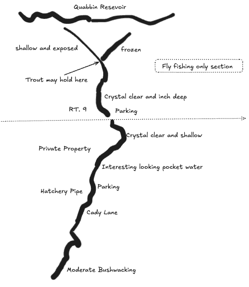

# Field Notes on Massachusetts' Swift River in March

---

> *I'm an out-of-state angler who doesn't know this river well. This is just what I found over two weekends. Every spot I mention is already named in a Boston Globe feature, a MassWildlife paper, and at least three fly fishing blogs. I'm not revealing anything.*

---

## Why I Drove South

In New Hampshire, trout fishing is pretty difficult until mid-May. I just needed to be on water until things warmed up. So when I kept reading about the Swift River and its promise of year-round trout fishing in a cold, clear tailwater below the Quabbin Reservoir, I did something I don't normally do: I drove south for trout.

The Swift has a reputation. [The Boston Globe](https://www.bostonglobe.com/2023/04/24/metro/swift-river-fly-fishing-massachusetts/) profiled it as a destination fishery. MassWildlife's own fisheries project leader has called it "essentially the perfect trout habitat" with stretches holding [several thousand wild brook trout per mile](https://www.mass.gov/info-details/swift-river-fisheries-research), some reaching 22 inches. Guides run trips on it. Fly shops sell flies tied specifically for it. Forums debate its pools like they're sacred water.

I went in early March, twice, and walked the river from the dam to about a mile past where the trail disappears. What I found didn't match the mystique.

## What I Found

The river starts at Winsor Dam, where cold water from the Quabbin boils up at what anglers call "the bubbler." In March this whole stretch was super low. Not enough depth or cover for trout to survive the birds and otters working it. I don't think anything was holding. The Y-Pool downstream is the only spot in the C&R section with real structure and depth, but I didn't see a fish. No risers, no shadows, nothing. Eight anglers were hitting it every day I was there, because it's the only water that even looks like it might have trout. Everyone fishing out of ritual, not evidence. The flat water between pools was the same. Crystal clear, super low. I walked it both weekends and never saw a fish.

Below Route 9, things changed. A little. The [McGlaughlin Hatchery pipe](https://blogflyfish.com/2015/09/overview-swift-river-hatchery-pipe-area.html) dumps nutrient-rich water into the Swift, and there's a deeper run here that actually holds fish. I saw trout sipping at something coming off the surface. Could have been midges, could have been food pellets from the pipe. I'm not really sure. I ended up putting a very nice rainbow in my net. This was the one spot on the entire river where I confirmed trout over two weekends.

Most people seem to show up around 11 AM, and that's when the action happens. I think it has something to do with whatever the hatchery pipe is putting out at that hour. Most people aren't harvesting, but two or three fish get pulled out of there on a given day. With so few trout in the system, even that adds up. The bigger issue is just how few fish there are to begin with.

**If you're going to fish the pipe:** these trout are unbelievably sensitive. Don't bother with an indicator nymph rig. They're taking and spitting tiny things so fast you'll never see the pause. Even poking at them with nymphs puts them down. Your best bet is to time the ~11 AM pellet hatch and try to provoke a reaction strike with a streamer. Black marabou or rabbit hair. Get it in their face and make them react. A Euro nymph setup with a pellet-style "trash fly" could also work since you'd feel the take instead of watching for it, but the crowding makes tight-line casting geometry tough. Once you miss that late-morning window, you're pretty much done for the day.

Further downstream, approaching Cady Lane, there are deeper pools that look very, very fishy. I didn't see anything in them, and I watched other anglers strike out too. Some insect emergence was happening, so there's food. Wild brook trout are supposed to be in this stretch, and I believe they probably are. Glued to the bottom in the woody structure, not moving in March. This is probably a timing issue, not a population collapse.

Below Cady Lane (where regulations shift to general regs year-round), there are pools running five feet deep. Real holding water. But still crystal clear, still low, and you can't cast into the good spots without wading in, which spooks everything. Past that, a bend with a rope swing almost certainly holds fish in warmer months. And past *that*, about a mile of bushwhacking through increasingly slow, wide water that stopped looking like trout habitat altogether. More like something you'd find on the Merrimack. I turned around.

## It's Not Just Me

The [Deerfield Fly Shop](https://deerfieldflyshop.com/river-report-mid-april/) reported almost the exact same picture in April 2025: "Despite recent stockings, the river is notably barren. Of course there are some fish pushed up into the Y-Pool and at the hatchery pipe, however, you'd be pretty hard pressed to find opportunities elsewhere, especially on the upper river." They noted otter activity, poaching (including a report of someone running a gill net across the pipe area), and concluded that "something funky is going on below Quabbin." That was a year before my visit. Same pattern.

[MassWildlife's own research](https://www.mass.gov/info-details/swift-river-fisheries-research) tells a troubling story too. Their mark-recapture study found that roughly 50% of stocked rainbows were unaccounted for within a week of being dropped in. By the study's end, only 14% of 3,326 stocked rainbows could be found. The decline was worst for fish stocked earlier in spring. Exactly when I was out there. The cause is officially unknown.

The crowding is real. I was there. River etiquette is wanting. [One guide](https://wakingupwater.wordpress.com/tag/swift-river/) said he won't take clients to the C&R section because it's overfished. The pandemic pushed more people into fly fishing, and the Swift, the only year-round accessible tailwater in the state, absorbed all of it.

Experienced [Swift anglers](https://blogflyfish.com/2014/11/swift-river-fly-fishing.html) have noted that winter dead zones are normal on this river, and that trout can completely vacate even the Y-Pool in cold months. That's fair. But I don't think the Swift is broken so much as it's facing a stack of pressures that add up: low water, active predators, stocked trout vanishing at rates that puzzle even MassWildlife, harvest at the pipe, year-round angler pressure, and poaching. No single one of these empties a river. But they stack.

## Conclusion

Almost certainly, this river is different right after stocking. Almost certainly, the Cady Lane brookies come alive in warmer weather. And I have no doubt that people who know this water intimately can find fish here when I couldn't.

But if you haven't fished the Swift your whole life and you aren't hitting it right after a stock, you will probably want to look elsewhere, or be prepared to grind. It could be different in summer, but after watching those stockies vanish from the data and seeing what's left in March, I'm really not sure it is once the initial post-stocking rush clears out. I could just be a bad fisherman. But I think my experience in early March would probably match yours.

The river draws crowds even when it's this empty. Some of the mystique may be undeserved in 2026. Maybe it was different once. Maybe it will be again. But right now, for an out-of-state angler chasing the reputation, the reality was one very nice rainbow in two weekends, on a river where I expected more.

It was a beautiful river, though. Genuinely stunning. And it was good to be outside.

